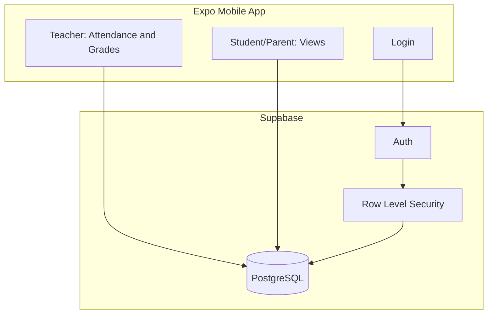

# School App

A mobile school platform for attendance tracking and grades, built for iOS and Android from a single codebase.

**Status:** In development — MVP focused on login, teacher attendance, and grades/report cards.

## Overview

School App helps teachers mark daily attendance and enter grades, while students and parents view attendance history and report cards. The long-term vision is a full school platform (announcements, homework, messaging, and more).

The UI draws from an earlier notebook-style prototype (Elmwood Academy demo data). Production onboarding for ~350 students and staff is planned via bulk CSV import in a later phase.

## Tech Stack

| Layer | Technology |
|-------|------------|
| Mobile | Expo SDK 52+, React Native, TypeScript |
| Navigation | Expo Router |
| Backend | Supabase (Auth, PostgreSQL, Row Level Security) |
| State | React Context + Supabase client |

## Architecture



See [docs/architecture.md](docs/architecture.md) for details.

## Getting Started

### Prerequisites

- Node.js 20+
- npm or yarn
- [Expo Go](https://expo.dev/go) on your phone, or Android/iOS simulator
- A [Supabase](https://supabase.com) project (free tier)

### Setup

```bash
git clone git@github.com:YOUR_USERNAME/school-app.git
cd school-app
npm install
cp .env.example .env
# Edit .env with your Supabase URL and anon key
npx expo start
```

Full instructions: [docs/setup.md](docs/setup.md)

## Project Structure

```
school-app/
├── app/                 # Expo Router screens (planned)
├── components/          # Shared UI components (planned)
├── lib/                 # Supabase client, auth, theme (planned)
├── supabase/            # Migrations and seed data (planned)
├── docs/                # Project documentation
├── CHANGELOG.md         # Session-by-session progress log
└── README.md
```

## Roles (MVP)

| Role | Capabilities |
|------|--------------|
| Teacher | Mark attendance, enter grades |
| Student | View own attendance and report card |
| Parent | View linked child's attendance and grades |
| Admin | Data managed via Supabase dashboard for MVP |

## Documentation

| Doc | Description |
|-----|-------------|
| [Setup](docs/setup.md) | Dev environment and Supabase configuration |
| [Architecture](docs/architecture.md) | System design and data flow |
| [Database](docs/database.md) | Schema, RLS policies, seed data |
| [Roadmap](docs/roadmap.md) | MVP scope and future phases |
| [Decisions](docs/decisions.md) | Architecture and technology choices |
| [Changelog](CHANGELOG.md) | What was built and when |

## Security

- Never commit `.env` or real school roster files
- Use demo seed data in the repository only
- Real production imports (~350 users) stay local and are not pushed to GitHub

## License

Private / personal project. All rights reserved.
