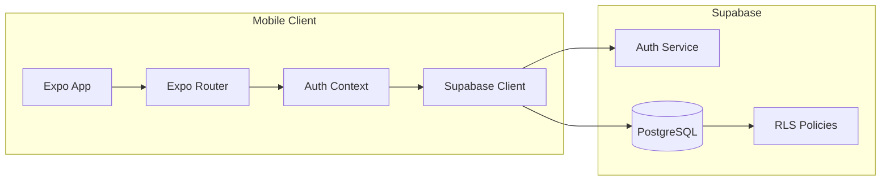

# Architecture

## System Overview

School App is a mobile-first application with a Supabase backend. The mobile client handles all user interaction; Supabase provides authentication, PostgreSQL storage, and row-level security for multi-role access.



## Layers

### Mobile (Expo + React Native)

- **Expo Router** — file-based routing with auth groups: `(auth)`, `(teacher)`, `(student)`
- **Auth context** — loads the signed-in user's profile and role, redirects to the correct home screen
- **Supabase client** — single shared instance in `lib/supabase.ts`
- **Theme** — notebook-style design tokens ported from the original prototype

### Backend (Supabase)

- **Auth** — email/password login; JWT attached to every request
- **PostgreSQL** — relational schema for schools, profiles, classes, attendance, and grades
- **Row Level Security** — enforces role-based data access at the database level

## Role-Based Access

| Role | Read | Write |
|------|------|-------|
| Teacher | Own classes, enrolled students, attendance, grades | Attendance and grades for own classes |
| Student | Own attendance and grades | — |
| Parent | Linked children's attendance and grades | — |
| Admin | All data within their school | All data within their school (MVP: via dashboard) |

## Data Flow

### Teacher marks attendance

1. Teacher selects class and date
2. App loads student roster from `class_enrollments`
3. Teacher sets status per student (present, absent, late, excused)
4. App upserts rows into `attendance_records`
5. RLS ensures teacher can only write to their assigned classes

### Teacher enters grades

1. Teacher selects class
2. App loads existing `grade_entries` for that class
3. Teacher adds or edits assignment scores
4. App inserts/updates `grade_entries`
5. RLS restricts writes to the teacher's classes

### Student views report card

1. Student logs in; profile role is `student`
2. App queries `grade_entries` filtered by `student_id`
3. Client computes letter grades from score percentages
4. RLS ensures student sees only their own records

### Parent views child's data

1. Parent logs in; profile role is `parent`
2. App resolves linked students via `parent_students`
3. Queries attendance and grades for the selected child
4. RLS restricts access to linked students only

## Planned Directory Structure

```
app/
├── (auth)/
│   └── login.tsx
├── (teacher)/
│   ├── classes.tsx
│   ├── attendance/[classId].tsx
│   └── grades/[classId].tsx
└── (student)/
    ├── attendance.tsx
    └── grades.tsx

lib/
├── supabase.ts      # Supabase client initialization
├── auth.tsx         # AuthProvider + useAuth hook
└── theme.ts         # Design tokens

components/
├── ScreenHeader.tsx
├── GradeCard.tsx
└── AttendanceBadge.tsx
```

## Security Model

- **Anon key only in the mobile app** — safe for client-side use with RLS enabled
- **Service role key** — never bundled in the app; used only for local import scripts
- **RLS on every table** — no table is publicly readable without a policy
- **No real roster data in git** — production CSV imports stay local

## Future Considerations

- Push notifications for attendance alerts and grade updates
- Offline attendance marking with sync
- Bulk import pipeline (v2) from Easy accounting software / Excel
- Optional web admin dashboard companion
