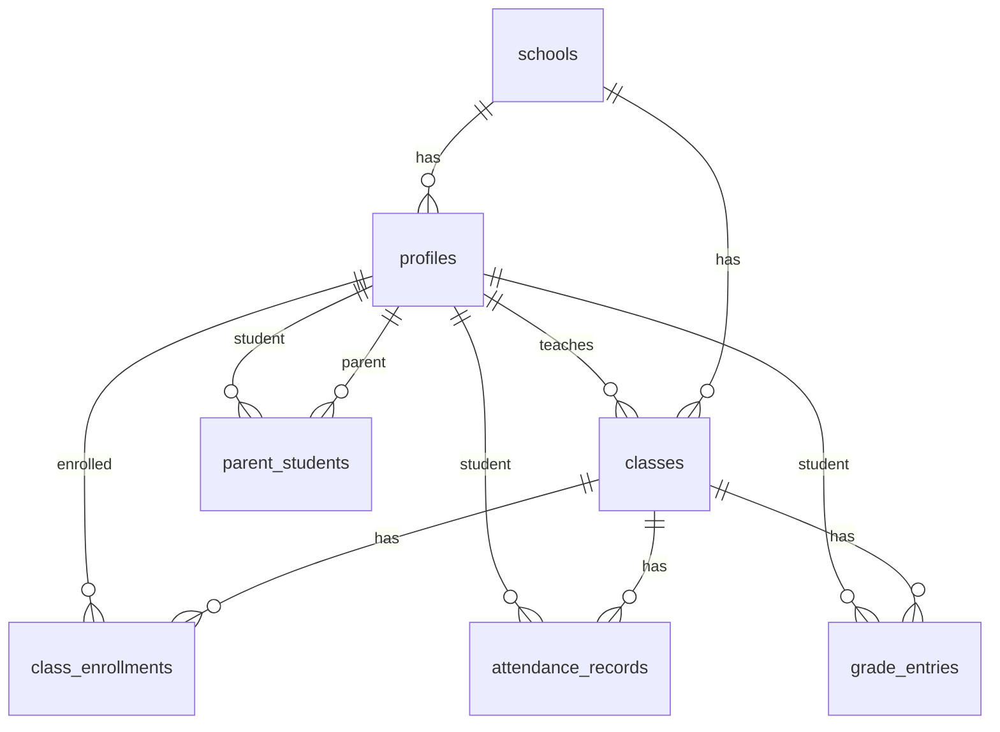

# Database

School App uses **Supabase PostgreSQL** with **Row Level Security (RLS)** on all application tables.

## Entity Relationship



## Tables

### `schools`

| Column | Type | Notes |
|--------|------|-------|
| id | uuid | Primary key |
| name | text | School name |

### `profiles`

Extends `auth.users` with application metadata.

| Column | Type | Notes |
|--------|------|-------|
| id | uuid | FK → auth.users.id |
| school_id | uuid | FK → schools.id |
| role | text | `admin`, `teacher`, `student`, `parent` |
| full_name | text | Display name |
| email | text | Login email |

### `classes`

| Column | Type | Notes |
|--------|------|-------|
| id | uuid | Primary key |
| school_id | uuid | FK → schools.id |
| name | text | e.g. "Algebra I — Period 2" |
| grade_level | text | e.g. "Grade 8" |
| teacher_id | uuid | FK → profiles.id |

### `class_enrollments`

| Column | Type | Notes |
|--------|------|-------|
| class_id | uuid | FK → classes.id |
| student_id | uuid | FK → profiles.id |

Primary key: `(class_id, student_id)`

### `parent_students`

| Column | Type | Notes |
|--------|------|-------|
| parent_id | uuid | FK → profiles.id |
| student_id | uuid | FK → profiles.id |

Primary key: `(parent_id, student_id)`

### `attendance_records`

| Column | Type | Notes |
|--------|------|-------|
| id | uuid | Primary key |
| class_id | uuid | FK → classes.id |
| student_id | uuid | FK → profiles.id |
| date | date | Attendance date |
| status | text | `present`, `absent`, `late`, `excused` |
| marked_by | uuid | FK → profiles.id (teacher) |
| notes | text | Optional |

Unique constraint: `(class_id, student_id, date)`

### `grade_entries`

| Column | Type | Notes |
|--------|------|-------|
| id | uuid | Primary key |
| class_id | uuid | FK → classes.id |
| student_id | uuid | FK → profiles.id |
| title | text | Assignment name |
| score | numeric | Points earned |
| max_score | numeric | Points possible |
| term | text | e.g. "Fall 2026" |
| entered_by | uuid | FK → profiles.id (teacher) |
| created_at | timestamptz | Auto-set |

## Row Level Security

RLS is enabled on all tables. Policies enforce access by role:

### Teachers

- **SELECT** classes where `teacher_id = auth.uid()`
- **SELECT** students enrolled in their classes
- **INSERT/UPDATE** attendance and grades for their classes only

### Students

- **SELECT** own attendance and grade records (`student_id = auth.uid()`)
- **SELECT** own class enrollments

### Parents

- **SELECT** attendance and grades for students linked in `parent_students`
- **SELECT** linked student profiles

### Admins

- **ALL** operations on rows where `school_id` matches their profile's school

## Seed Data (Demo)

The seed script (`supabase/seed.sql`) creates:

- 1 school: **Elmwood Academy**
- 1 admin, 2 teachers, 5 students, 2 parents
- 2 classes with enrollments
- Sample attendance records and grade entries

Seed data uses fake emails (`@elmwood.demo`) — safe for a public repository.

## Production Scale

The school has ~350 students and staff. Production onboarding (v2) will use bulk CSV import, not manual entry or seed scripts. See [roadmap.md](roadmap.md).

Real import files and service-role keys must **never** be committed to git.

## Migrations

Migration files live in `supabase/migrations/` and are applied in timestamp order:

```
supabase/migrations/
├── 000001_create_schools_and_profiles.sql
├── 000002_create_classes_and_enrollments.sql
├── 000003_create_attendance_and_grades.sql
└── 000004_rls_policies.sql
```

> Migration filenames are planned — files will be created during Supabase setup.
