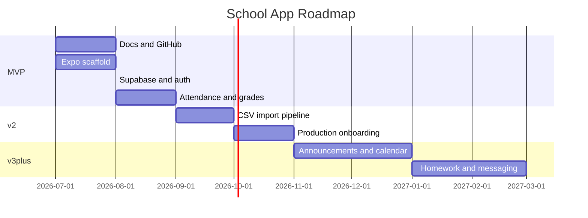

# Roadmap

## Vision

A full mobile school platform: attendance, grades, announcements, calendar, homework, and messaging — starting with the features teachers and families need most.

## Phase 1 — MVP (current)

**Goal:** Working mobile app with login, attendance, and grades using demo data.

| Feature | Status |
|---------|--------|
| Project docs and GitHub setup | In progress |
| Expo + TypeScript + Expo Router scaffold | Planned |
| Supabase schema, RLS, seed data | Planned |
| Auth with role-based routing | Planned |
| Teacher: mark attendance | Planned |
| Teacher: enter grades | Planned |
| Student: view attendance history | Planned |
| Student: view report card | Planned |
| Parent: view linked child's data | Planned |
| Notebook UI design tokens | Planned |

**Out of scope for MVP:**

- In-app people management (add/edit students, staff)
- Calendar, news, homework, messaging (mocked in original prototype)
- Push notifications and offline sync
- Real school data import (~350 users)

## Phase 2 — People Onboarding

**Goal:** Import real students, teachers, staff, and parents from existing school records.

| Feature | Notes |
|---------|-------|
| CSV import template | Standard format for students, staff, parents, enrollments |
| Import validation script | Checks required fields before creating accounts |
| Easy software discovery | Determine what the school's accounting software can export |
| Excel → CSV bridge | Fallback if Easy export is limited |
| Parent–student linking | Bulk link parents to children during import |
| Admin upload screen (optional) | In-app CSV upload for future roster updates |

**Data sources (TBD with school owner):**

- Easy accounting software
- Word / Excel rosters

**Scale:** ~350 students + staff

## Phase 3 — Communication

| Feature | Notes |
|---------|-------|
| Announcements | School-wide and class-specific news |
| Calendar events | Deadlines, holidays, sports, concerts |
| From prototype | Already designed in original UI mockup |

## Phase 4 — Assignments & Messaging

| Feature | Notes |
|---------|-------|
| Homework tracking | Assignments with due dates and completion |
| Teacher–parent messaging | Thread-based communication |
| From prototype | Already designed in original UI mockup |

## Phase 5 — Platform Enhancements

| Feature | Notes |
|---------|-------|
| Push notifications | Attendance alerts, grade updates |
| Offline attendance | Mark attendance without connectivity, sync later |
| Multi-school support | If expanding beyond a single school |

## Phase 6 — Web Admin (optional)

| Feature | Notes |
|---------|-------|
| Web dashboard | Manage rosters, view reports, bulk operations |
| React web companion | Shares Supabase backend with mobile app |

## Milestones

> Dates are estimates and will be updated as work progresses.
